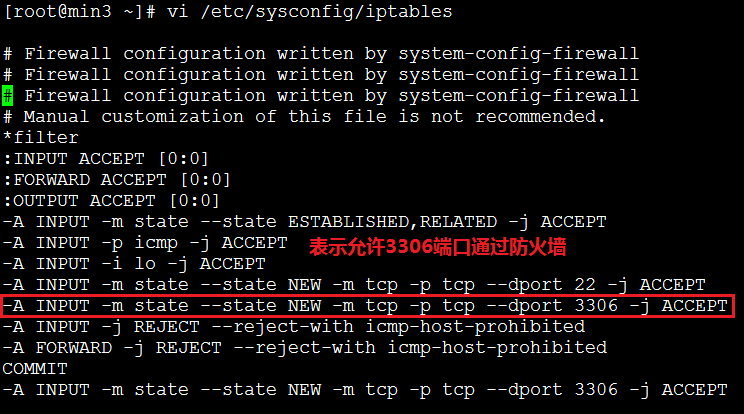
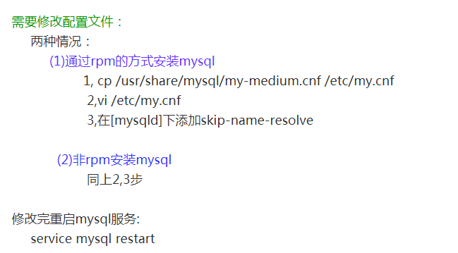

#### sqlyog连接linux下的mysql遇到的问题

1. ##### 创建新连接时，提示错误：Con't connect to MySql server

   ```
   这是因为连接时3306端口被防火墙给阻挡了
   解决方法：
   直接在iptables中添加允许规则(注意不是添加在后面,还要注意的是添加该允许规则后就不用管iptables是否处于开关状态了)
   ```

   

2. ##### 创建新连接时，提示错误：1042 can not get hostname for your address

   ##### 